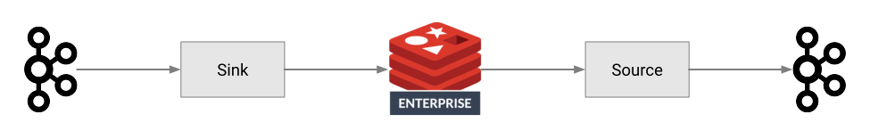

= {project-name}
:author: Julien Ruaux <julien@redislabs.com>
:revnumber: {project-version}
:docinfo1:

== Introduction

The {project-name} is used to import and export data between Apache Kafka and Redis Enterprise.

This guide provides documentation and usage information across the following topics:

* <<install,Install>>
* <<connect,Connect to Redis Enterprise>>
* <<sink,Sink Connector>>
* <<source,Source Connector>>
* <<docker,Docker Example>>
* <<links,Resources>>

:leveloffset: 1
[[install]]
include::_install.adoc[]

[[connect]]
include::_connect.adoc[]

[[sink]]
include::_sink.adoc[]

[[source]]
include::_source.adoc[]

[[docker]]
include::_docker.adoc[]

[[links]]
include::_links.adoc[]