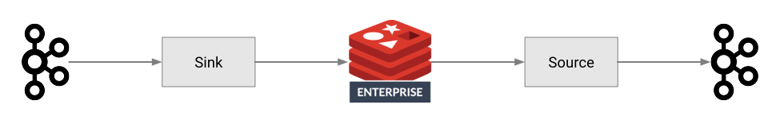

= {project-name}
:revnumber: {project-version}
:docinfo1:

== Introduction

The {project-name} is used to import and export data between Apache Kafka and Redis.

This guide provides documentation and usage information across the following topics:

* <<install,Install>>
* <<connect,Connect to Redis>>
* <<sink,Sink Connector>>
* <<source,Source Connector>>
* <<docker,Docker Example>>
* <<resources,Resources>>

:leveloffset: 1

include::_install.adoc[]

include::_connect.adoc[]

include::_sink.adoc[]

include::_source.adoc[]

include::_docker.adoc[]

include::_resources.adoc[]